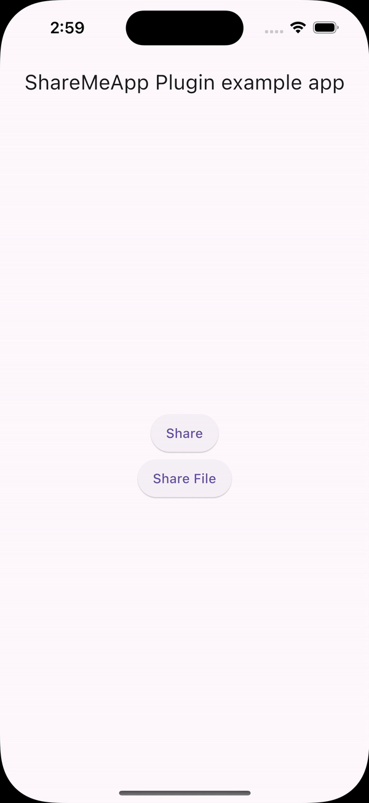
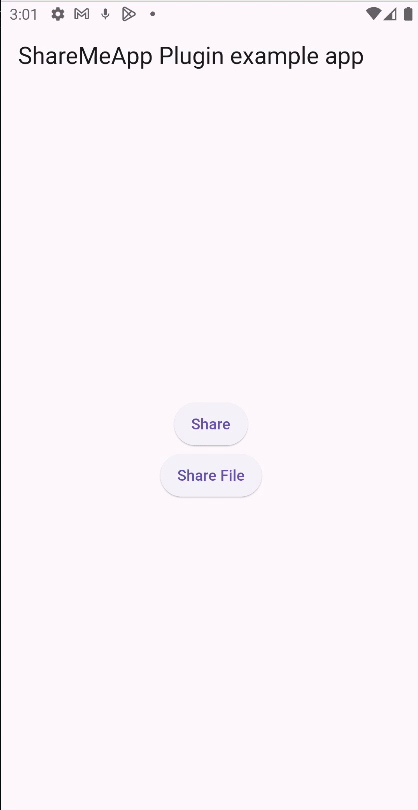

# share_me

ShareMe is a package that uses native code to share content on iOS and Android devices in an easy, fast, and simple way.

## Introduction

Works on both platforms `iOS` and `Android`

Two options are provided at the moment: ShareMe.system() and ShareMe.file()

## Usage

### Android Configuration

#### Paste the following attribute in the `manifest` tag in the `android/app/src/main/AndroidManifest.xml`:

```
 		`xmlns:tools="http://schemas.android.com/tools"`
```

##### For example:

```
        <manifest xmlns:android="http://schemas.android.com/apk/res/android"
                xmlns:tools="http://schemas.android.com/tools"
                package="your package...">
```

#### Add this piece of code in the `manifest/application` in the `android/app/src/main/AndroidManifest.xml`:

```
    <provider android:name="androidx.core.content.FileProvider" 
            android:authorities="${applicationId}.fileprovider" 
            android:exported="false" 
            android:grantUriPermissions="true" 
            tools:replace="android:authorities">
            <meta-data 
                android:name="android.support.FILE_PROVIDER_PATHS" 
                android:resource="@xml/file_paths"/>
    </provider>
```

#### Create a xml file named `file_paths.xml` in the `app/src/main/res/xml` folder and paste this code in the file :

```
            <paths>
                <cache-path
                    name="cache"
                    path="." />
            </paths>

```

### iOS Configuration

#### Add this to your `Info.plist` to use ShareMe.file()

```
    <key>NSPhotoLibraryUsageDescription</key>
    <string>Need gallery permissions</string>
```


This will open the default native share options

```

```

# Here's few demo!

## Share on iOS



## Share on Android



# Buy me a :coffee: !!

((More coffee == more code) == faster updates)

[](https://paypal.me/jjsd)
